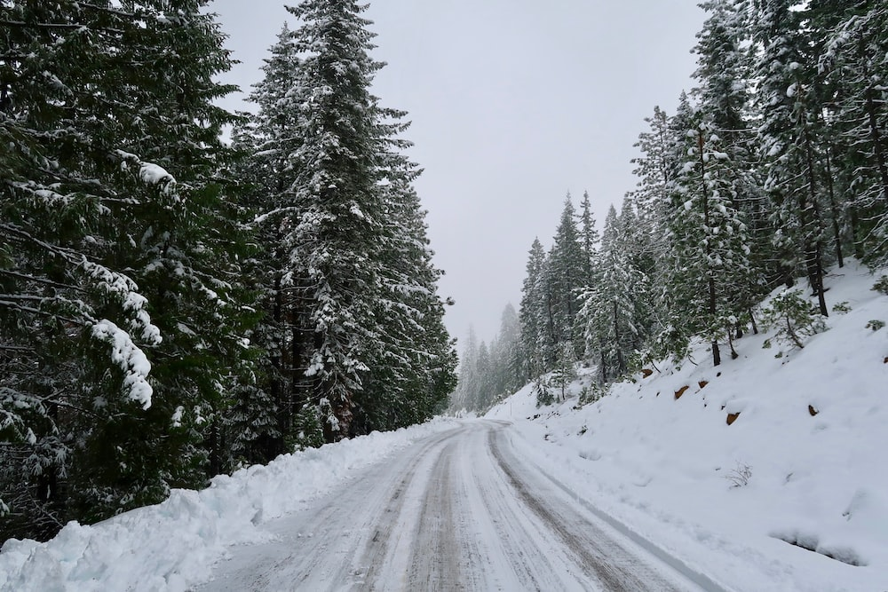

# Trimble
This my project for trimble test assessment, you can find the article resume, the report and the code here.

I also upload my dataset [here](https://drive.google.com/file/d/14n5XoWrHBCklYNPwWQtT_ZKek1UTB2eH/view?usp=sharing).
## Requirements

To setup the environment run :

`conda env create trimble --file requirements.txt` 

Then do 

`conda activate env trimble` 


## How to run the API
You can find a streamlit api in the `app` folder.
To use it go to the `app` folder and run this command :

```streamlit run detection_app.py```

## Exemple of new data

This unseen environement was classified as road.


Louis B.
